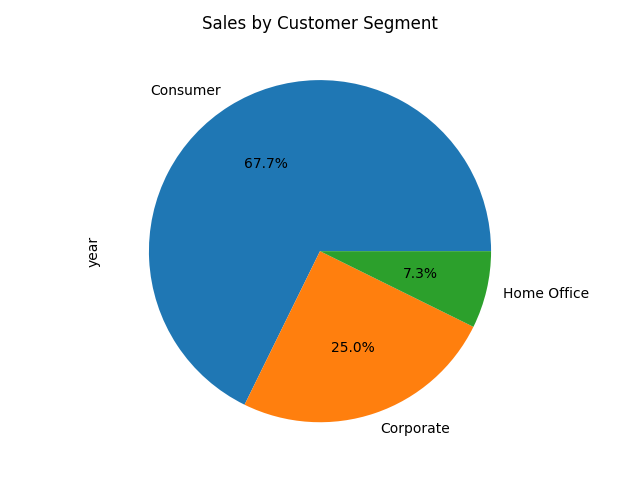
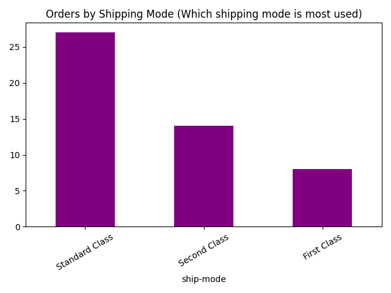
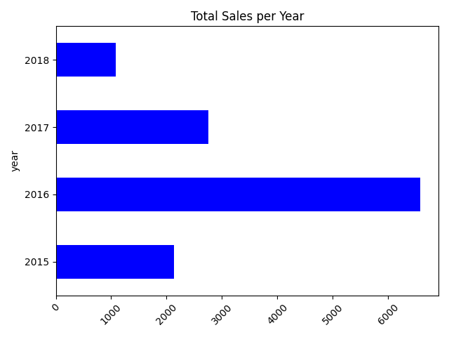
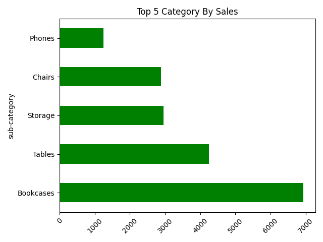

# 📊 CSV Data Cleaner & Insights Generator

## Overview

A Python tool that cleans CSV data and creates simple business insights like total sales, top category, region, and segment.

---

## ✨ Features

* Cleans and formats CSV data
* Fixes and parses dates
* Removes basic data issues
* Calculates sales summaries
* Finds top category, region, and segment
* Saves results in a text file (`insights.txt`)

---

## 📄 Example Output

```
Data Insights:
- Total Sales: $125430.55
- Technology is the top category with $45210.30 sales.
- West region has the highest sales: $38920.10.
- Consumer segment leads with $61200.45 sales.
```

---

## 🛠️ Tech Used

* Python
* Pandas
* Matplotlib

---

## ▶️ How to Run

```bash
python main.py
```

Make sure your CSV file path is correct in the code.

---

## 📊 Charts
 
 
 
 
